# Comparing Algorithms
DocOfi  
October 16, 2015  


###Edgar Anderson's Iris Data
We will be comparing the performance of different classifiers on the famous (Fisher's or Anderson's) iris data set which gives the measurements in centimeters of the variables sepal length and width and petal length and width, respectively, for 50 flowers from each of 3 species of iris. The species are Iris setosa, versicolor, and virginica. I divided the raw data in half to create a training and testing dataset to assess the model's performance.  The model's accuracy and kappa values on the training and testing dataset are used as reference.

What i'm particularly interested in are, which particular data points are commonly or unusually misclassified and which models misclassify the same pattern of data points. I made a plot with the shape of the data points to illustrate the species to which the data point belong.  The color of the data point reveals whether the data point was correctly or incorrectly classified by the model.  I created a table of contents that will make it easirer to jump to the different plots at the click of a mouse.  You can load this html doument in three to four windows to make the comparison easier.

At the bottom of the document, the testing dataset is available for your perusal.  You might be wondering why in certain plots the misclassified point may be missing.  This is caused by overplotting, one or more data points occupy the same space.  The darker color of the correctly classified data point masks the lighter color of the misclassified point.  I included a table of the unique values in each variable so you can see which have duplicate values to make it easier to identify where the misclassified point is located.  I also created 2 plots per model with the same variable on the x-axis to make it easier to find the masked misclassified point and to give an additional dimension in viewing the data points.  

###A brief look at the data

```r
library(knitr)
library(ggplot2)
data("iris")
str(iris)
```

```
## 'data.frame':	150 obs. of  5 variables:
##  $ Sepal.Length: num  5.1 4.9 4.7 4.6 5 5.4 4.6 5 4.4 4.9 ...
##  $ Sepal.Width : num  3.5 3 3.2 3.1 3.6 3.9 3.4 3.4 2.9 3.1 ...
##  $ Petal.Length: num  1.4 1.4 1.3 1.5 1.4 1.7 1.4 1.5 1.4 1.5 ...
##  $ Petal.Width : num  0.2 0.2 0.2 0.2 0.2 0.4 0.3 0.2 0.2 0.1 ...
##  $ Species     : Factor w/ 3 levels "setosa","versicolor",..: 1 1 1 1 1 1 1 1 1 1 ...
```

```r
print(kable(summary(iris)))
```

```
## 
## 
##       Sepal.Length    Sepal.Width     Petal.Length    Petal.Width          Species 
## ---  --------------  --------------  --------------  --------------  --------------
##      Min.   :4.300   Min.   :2.000   Min.   :1.000   Min.   :0.100   setosa    :50 
##      1st Qu.:5.100   1st Qu.:2.800   1st Qu.:1.600   1st Qu.:0.300   versicolor:50 
##      Median :5.800   Median :3.000   Median :4.350   Median :1.300   virginica :50 
##      Mean   :5.843   Mean   :3.057   Mean   :3.758   Mean   :1.199   NA            
##      3rd Qu.:6.400   3rd Qu.:3.300   3rd Qu.:5.100   3rd Qu.:1.800   NA            
##      Max.   :7.900   Max.   :4.400   Max.   :6.900   Max.   :2.500   NA
```

###Creating a training and testing data set and setting the parameters for cross validation

```r
library(caret)
set.seed(117)
inTrain <- createDataPartition(y=iris$Species,p=0.5,list=FALSE)
training <- iris[inTrain,] 
testing <- iris[-inTrain,]
ctrl = trainControl(method="repeatedcv", number=10, repeats=5)
```

###Plotting the data with the shape and color describing the Species to which it belongs.

```r
library(ggplot2)
ggplot(testing) + geom_point(aes(Petal.Length, Petal.Width, colour = Species, shape = Species), size = 2.5) + labs(x = "Petal.Length", y = "Petal.Width") 
```

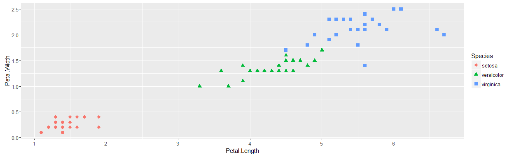


```r
ggplot(testing) + geom_point(aes(Petal.Length, Sepal.Length, colour = Species, shape = Species), size = 2.5) + labs(x = "Petal.Length", y = "Sepal.Length") 
```

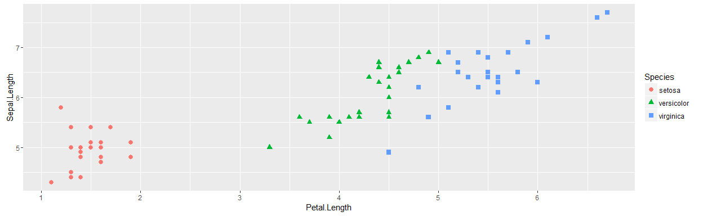

####RPART Model

```r
set.seed(117)
rpart_fit <- train(Species~.,method="rpart",data=training, tuneLength = 15, trControl = ctrl)
rpart_pred <-predict(rpart_fit, newdata = testing)
```

####Model Performance 

```r
library(caret)
rpart_correct <- rpart_pred == testing$Species
confusionMatrix(rpart_fit)###Misclasification on the training data
```

```
## Cross-Validated (10 fold, repeated 5 times) Confusion Matrix 
## 
## (entries are percentages of table totals)
##  
##             Reference
## Prediction   setosa versicolor virginica
##   setosa       33.4        0.0       0.0
##   versicolor    0.0       29.3       2.5
##   virginica     0.0        4.0      30.8
```

```r
table(rpart_pred,testing$Species)###Misclasification on the testing data
```

```
##             
## rpart_pred   setosa versicolor virginica
##   setosa         25          0         0
##   versicolor      0         22         1
##   virginica       0          3        24
```

```r
getTrainPerf(rpart_fit)###Model's performance on the training data
```

```
##   TrainAccuracy TrainKappa method
## 1     0.9350397  0.9013114  rpart
```

```r
postResample(rpart_pred, testing$Species)###Model's performance on the testing data
```

```
##  Accuracy     Kappa 
## 0.9466667 0.9200000
```

###Misclassified points illustrated in the rpart plot

```r
library(ggplot2)
ggplot(testing) + geom_point(aes(Petal.Length, Petal.Width, colour = rpart_correct, shape = Species),size = 2.5) + labs(x = "Petal.Length", y = "Petal.Width") 
```

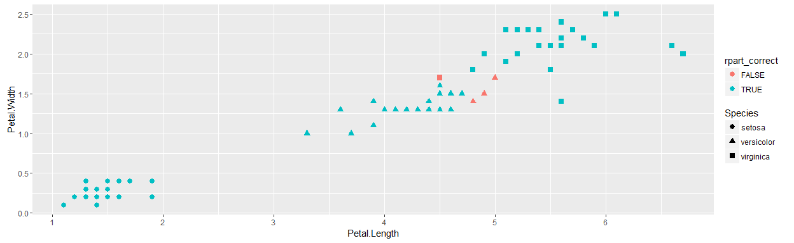


```r
ggplot(testing) + geom_point(aes(Petal.Length, Sepal.Length, colour = rpart_correct, shape = Species), size = 2.5) + labs(x = "Petal.Length", y = "Sepal.Length") 
```


**These are the misclassified points on the rpart plot.**

```r
testing2 <- testing
testing2$Row.Num <- rownames(testing2)
rownames(testing2) <- NULL
subset(testing2, Row.Num == 107 | Row.Num == 77 | Row.Num == 53 | Row.Num == 78)
```

```
##    Sepal.Length Sepal.Width Petal.Length Petal.Width    Species Row.Num
## 27          6.9         3.1          4.9         1.5 versicolor      53
## 40          6.8         2.8          4.8         1.4 versicolor      77
## 41          6.7         3.0          5.0         1.7 versicolor      78
## 56          4.9         2.5          4.5         1.7  virginica     107
```

####Linear Discriminant Analysis (LDA)  Model

```r
set.seed(117)
lda_fit <- train(Species~.,method="lda",data=training, tuneLength = 15, trControl = ctrl)
lda_pred <-predict(lda_fit, newdata = testing)
```

####Model Performance

```r
library(caret)
lda_correct <- lda_pred == testing$Species
confusionMatrix(lda_fit)###Misclasification on the training data
```

```
## Cross-Validated (10 fold, repeated 5 times) Confusion Matrix 
## 
## (entries are percentages of table totals)
##  
##             Reference
## Prediction   setosa versicolor virginica
##   setosa       33.4        0.0       0.0
##   versicolor    0.0       29.6       1.3
##   virginica     0.0        3.7      32.1
```

```r
table(lda_pred,testing$Species)###Misclasification on the testing data
```

```
##             
## lda_pred     setosa versicolor virginica
##   setosa         25          0         0
##   versicolor      0         24         0
##   virginica       0          1        25
```

```r
getTrainPerf(lda_fit)###Model's performance on the training data
```

```
##   TrainAccuracy TrainKappa method
## 1     0.9500397  0.9244611    lda
```

```r
postResample(lda_pred, testing$Species)###Model's performance on the testing data
```

```
##  Accuracy     Kappa 
## 0.9866667 0.9800000
```

###Misclassified points illustrated in the lda plot

```r
library(ggplot2)
ggplot(testing) + geom_point(aes(Petal.Length, Petal.Width, colour = lda_correct, shape = Species),size = 2.5) + labs(x = "Petal.Length", y = "Petal.Width") 
```

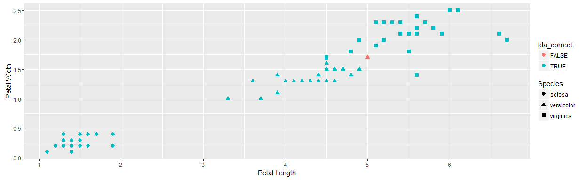


```r
ggplot(testing) + geom_point(aes(Petal.Length, Sepal.Length, colour = lda_correct, shape = Species), size = 2.5) + labs(x = "Petal.Length", y = "Sepal.Length") 
```

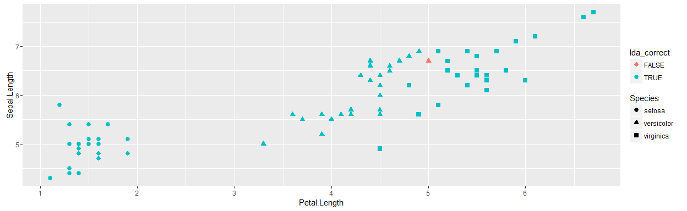

**These are the misclassified points on the lda plot.**

```r
subset(testing2, Row.Num == 78)
```

```
##    Sepal.Length Sepal.Width Petal.Length Petal.Width    Species Row.Num
## 41          6.7           3            5         1.7 versicolor      78
```

####Support Vector Machine (SVM) Model

```r
set.seed(117)
svm_fit <- train(Species~.,method="svmRadial",data=training, tuneLength = 15, trControl = ctrl)
svm_pred <-predict(svm_fit, newdata = testing)
```

####Model Performance

```r
library(caret)
svm_correct <- svm_pred == testing$Species
confusionMatrix(svm_fit)###Misclasification on the training data
```

```
## Cross-Validated (10 fold, repeated 5 times) Confusion Matrix 
## 
## (entries are percentages of table totals)
##  
##             Reference
## Prediction   setosa versicolor virginica
##   setosa       33.4        0.0       0.0
##   versicolor    0.0       28.4       2.6
##   virginica     0.0        4.9      30.7
```

```r
table(svm_pred,testing$Species)###Misclasification on the testing data
```

```
##             
## svm_pred     setosa versicolor virginica
##   setosa         24          0         0
##   versicolor      1         23         2
##   virginica       0          2        23
```

```r
getTrainPerf(svm_fit)###Model's performance on the training data
```

```
##   TrainAccuracy TrainKappa    method
## 1     0.9252778  0.8868513 svmRadial
```

```r
postResample(svm_pred, testing$Species)###Model's performance on the testing data
```

```
##  Accuracy     Kappa 
## 0.9333333 0.9000000
```

###Misclassified points illustrated in the svm plot

```r
library(ggplot2)
ggplot(testing) + geom_point(aes(Petal.Length, Petal.Width, colour = svm_correct, shape = Species),size = 2.5) + labs(x = "Petal.Length", y = "Petal.Width") 
```


```r
ggplot(testing) + geom_point(aes(Petal.Length, Sepal.Length, colour = svm_correct, shape = Species), size = 2.5) + labs(x = "Petal.Length", y = "Sepal.Length") 
```

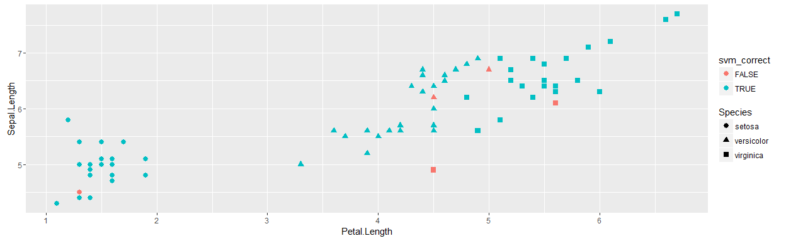

**These are the misclassified points on the svm plot.**

```r
subset(testing2, Row.Num == 42 | Row.Num == 107 | Row.Num == 135 | Row.Num == 78 | Row.Num == 69)
```

```
##    Sepal.Length Sepal.Width Petal.Length Petal.Width    Species Row.Num
## 21          4.5         2.3          1.3         0.3     setosa      42
## 36          6.2         2.2          4.5         1.5 versicolor      69
## 41          6.7         3.0          5.0         1.7 versicolor      78
## 56          4.9         2.5          4.5         1.7  virginica     107
## 67          6.1         2.6          5.6         1.4  virginica     135
```

####Random Forest Model

```r
set.seed(117)
rf_fit <- train(Species~.,method="rf",data=training, tuneLength = 15, trControl = ctrl)
```

```
## note: only 3 unique complexity parameters in default grid. Truncating the grid to 3 .
```

```r
rf_pred <-predict(rf_fit, newdata = testing)
```

####Model Performance

```r
library(caret)
rf_correct <- rf_pred == testing$Species
confusionMatrix(rf_fit)###Misclasification on the training data
```

```
## Cross-Validated (10 fold, repeated 5 times) Confusion Matrix 
## 
## (entries are percentages of table totals)
##  
##             Reference
## Prediction   setosa versicolor virginica
##   setosa       33.4        0.0       0.0
##   versicolor    0.0       29.3       3.2
##   virginica     0.0        4.0      30.1
```

```r
table(rf_pred,testing$Species)###Misclasification on the testing data
```

```
##             
## rf_pred      setosa versicolor virginica
##   setosa         25          0         0
##   versicolor      0         24         2
##   virginica       0          1        23
```

```r
getTrainPerf(rf_fit)###Model's performance on the training data
```

```
##   TrainAccuracy TrainKappa method
## 1     0.9280556  0.8908101     rf
```

```r
postResample(rf_pred, testing$Species)###Model's performance on the testing data
```

```
## Accuracy    Kappa 
##     0.96     0.94
```

###Misclassified points illustrated in the rf plot

```r
library(ggplot2)
ggplot(testing) + geom_point(aes(Petal.Length, Petal.Width, colour = rf_correct, shape = Species),size = 2.5) + labs(x = "Petal.Length", y = "Petal.Width") 
```


```r
ggplot(testing) + geom_point(aes(Petal.Length, Sepal.Length, colour = rf_correct, shape = Species), size = 2.5) + labs(x = "Petal.Length", y = "Sepal.Length") 
```

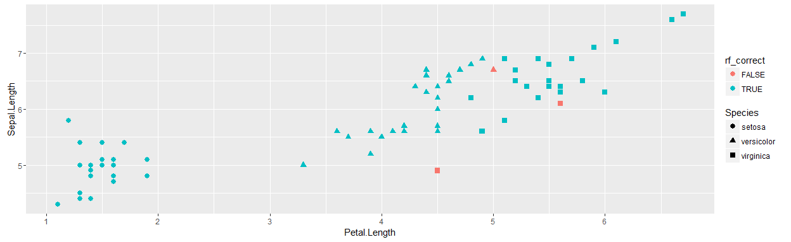

**These are the misclassified points on the rf plot.**

```r
subset(testing2, Row.Num == 135 | Row.Num == 107 | Row.Num == 78)
```

```
##    Sepal.Length Sepal.Width Petal.Length Petal.Width    Species Row.Num
## 41          6.7         3.0          5.0         1.7 versicolor      78
## 56          4.9         2.5          4.5         1.7  virginica     107
## 67          6.1         2.6          5.6         1.4  virginica     135
```

####Stochastic Gradient Boosting Model

```r
set.seed(117)
gbm_fit <- train(Species~.,method="gbm",data=training, tuneLength = 15, trControl = ctrl, verbose = FALSE)
gbm_pred <-predict(gbm_fit, newdata = testing)
```

####Model Performance

```r
library(caret)
gbm_correct <-gbm_pred == testing$Species
confusionMatrix(gbm_fit)###Misclasification on the training data
```

```
## Cross-Validated (10 fold, repeated 5 times) Confusion Matrix 
## 
## (entries are percentages of table totals)
##  
##             Reference
## Prediction   setosa versicolor virginica
##   setosa       33.4        0.0       0.0
##   versicolor    0.0       29.3       2.4
##   virginica     0.0        4.0      30.9
```

```r
table(gbm_pred,testing$Species)###Misclasification on the testing data
```

```
##             
## gbm_pred     setosa versicolor virginica
##   setosa         25          0         0
##   versicolor      0         23         2
##   virginica       0          2        23
```

```r
getTrainPerf(gbm_fit)###Model's performance on the training data
```

```
##   TrainAccuracy TrainKappa method
## 1     0.9356349  0.9024165    gbm
```

```r
postResample(gbm_pred, testing$Species)###Model's performance on the testing data
```

```
##  Accuracy     Kappa 
## 0.9466667 0.9200000
```

###Misclassified points illustrated in the  gbm plot

```r
library(ggplot2)
ggplot(testing) + geom_point(aes(Petal.Length, Petal.Width, colour = gbm_correct, shape = Species),size = 2.5) + labs(x = "Petal.Length", y = "Petal.Width") 
```

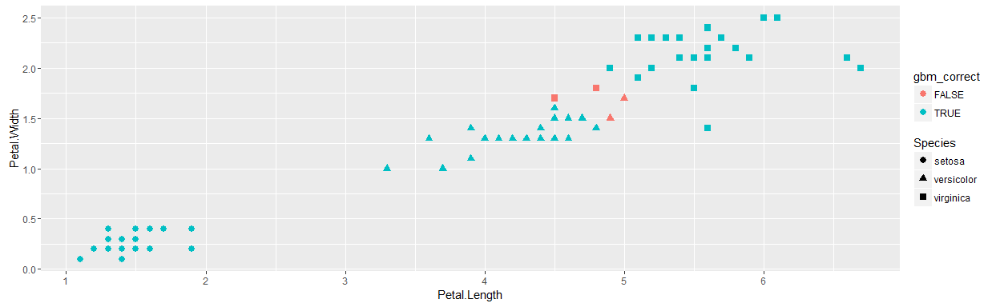


```r
ggplot(testing) + geom_point(aes(Petal.Length, Sepal.Length, colour = gbm_correct, shape = Species), size = 2.5) + labs(x = "Petal.Length", y = "Sepal.Length") 
```


**These are the misclassified points on the gbm plot.**

```r
subset(testing2, Row.Num == 127 | Row.Num == 107 | Row.Num == 78 | Row.Num == 53)
```

```
##    Sepal.Length Sepal.Width Petal.Length Petal.Width    Species Row.Num
## 27          6.9         3.1          4.9         1.5 versicolor      53
## 41          6.7         3.0          5.0         1.7 versicolor      78
## 56          4.9         2.5          4.5         1.7  virginica     107
## 64          6.2         2.8          4.8         1.8  virginica     127
```

####Penalized Logistic Regression Model 

```r
set.seed(117)
plr_fit <- train(Species~.,method="plr",data=training, tuneLength = 15, trControl = ctrl)
plr_pred <-predict(plr_fit, newdata = testing)
```

####Model Performance

```r
library(caret)
plr_correct <-plr_pred == testing$Species
confusionMatrix(plr_fit)###Misclasification on the training data
```

```
## Cross-Validated (10 fold, repeated 5 times) Confusion Matrix 
## 
## (entries are percentages of table totals)
##  
##             Reference
## Prediction   setosa versicolor virginica
##   setosa       33.4        0.0       0.0
##   versicolor    0.0       33.3      33.3
##   virginica     0.0        0.0       0.0
```

```r
table(plr_pred,testing$Species)###Misclasification on the testing data
```

```
##             
## plr_pred     setosa versicolor virginica
##   setosa         25          0         0
##   versicolor      0         25        25
##   virginica       0          0         0
```

```r
getTrainPerf(plr_fit)###Model's performance on the training data
```

```
##   TrainAccuracy TrainKappa method
## 1     0.6666667  0.4989167    plr
```

```r
postResample(plr_pred, testing$Species)###Model's performance on the testing data
```

```
##  Accuracy     Kappa 
## 0.6666667 0.5000000
```

###Misclassified points illustrated in the plr plot

```r
library(ggplot2)
ggplot(testing) + geom_point(aes(Petal.Length, Petal.Width, colour = plr_correct, shape = Species),size = 2.5) + labs(x = "Petal.Length", y = "Petal.Width") 
```

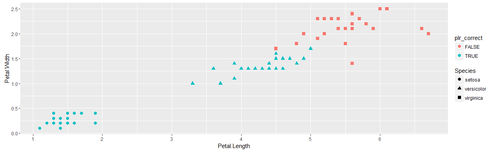


```r
ggplot(testing) + geom_point(aes(Petal.Length, Sepal.Length, colour = plr_correct, shape = Species), size = 2.5) + labs(x = "Petal.Length", y = "Sepal.Length") 
```

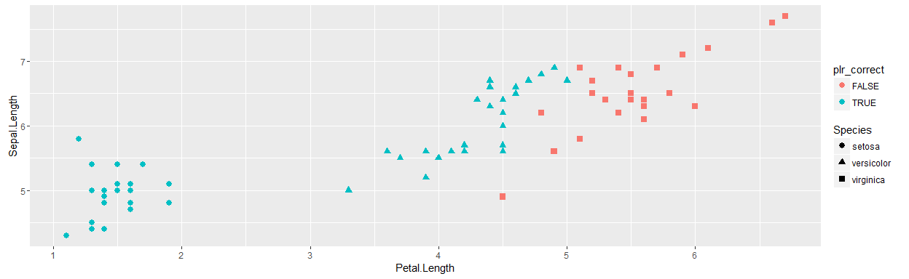

**These are the misclassified points on the plr plot. I need to find out why???**

```r
subset(testing2, Species == "virginica")
```

```
##    Sepal.Length Sepal.Width Petal.Length Petal.Width   Species Row.Num
## 51          6.3         3.3          6.0         2.5 virginica     101
## 52          5.8         2.7          5.1         1.9 virginica     102
## 53          7.1         3.0          5.9         2.1 virginica     103
## 54          6.5         3.0          5.8         2.2 virginica     105
## 55          7.6         3.0          6.6         2.1 virginica     106
## 56          4.9         2.5          4.5         1.7 virginica     107
## 57          7.2         3.6          6.1         2.5 virginica     110
## 58          6.8         3.0          5.5         2.1 virginica     113
## 59          6.4         3.2          5.3         2.3 virginica     116
## 60          6.5         3.0          5.5         1.8 virginica     117
## 61          6.9         3.2          5.7         2.3 virginica     121
## 62          5.6         2.8          4.9         2.0 virginica     122
## 63          7.7         2.8          6.7         2.0 virginica     123
## 64          6.2         2.8          4.8         1.8 virginica     127
## 65          6.4         2.8          5.6         2.1 virginica     129
## 66          6.4         2.8          5.6         2.2 virginica     133
## 67          6.1         2.6          5.6         1.4 virginica     135
## 68          6.3         3.4          5.6         2.4 virginica     137
## 69          6.4         3.1          5.5         1.8 virginica     138
## 70          6.9         3.1          5.4         2.1 virginica     140
## 71          6.9         3.1          5.1         2.3 virginica     142
## 72          5.8         2.7          5.1         1.9 virginica     143
## 73          6.7         3.0          5.2         2.3 virginica     146
## 74          6.5         3.0          5.2         2.0 virginica     148
## 75          6.2         3.4          5.4         2.3 virginica     149
```

####Partial Least Squares Model

```r
set.seed(117)
pls_fit <- train(Species~.,method="pls",data=training, tuneLength = 15, trControl = ctrl)
pls_pred <-predict(pls_fit, newdata = testing)
```

####Model Performance

```r
library(caret)
pls_correct <-pls_pred == testing$Species
confusionMatrix(pls_fit)###Misclasification on the training data
```

```
## Cross-Validated (10 fold, repeated 5 times) Confusion Matrix 
## 
## (entries are percentages of table totals)
##  
##             Reference
## Prediction   setosa versicolor virginica
##   setosa       33.4        0.0       0.0
##   versicolor    0.0       24.7       4.1
##   virginica     0.0        8.6      29.2
```

```r
table(pls_pred,testing$Species)###Misclasification on the testing data
```

```
##             
## pls_pred     setosa versicolor virginica
##   setosa         24          0         0
##   versicolor      1         12         2
##   virginica       0         13        23
```

```r
getTrainPerf(pls_fit)###Model's performance on the training data
```

```
##   TrainAccuracy TrainKappa method
## 1     0.8731746  0.8091949    pls
```

```r
postResample(pls_pred, testing$Species)###Model's performance on the testing data
```

```
##  Accuracy     Kappa 
## 0.7866667 0.6800000
```

###Misclassified points illustrated in the pls plot

```r
library(ggplot2)
ggplot(testing) + geom_point(aes(Petal.Length, Petal.Width, colour = pls_correct, shape = Species),size = 2.5) + labs(x = "Petal.Length", y = "Petal.Width") 
```

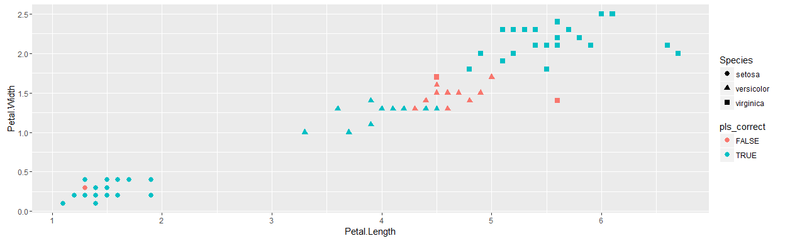


```r
ggplot(testing) + geom_point(aes(Petal.Length, Sepal.Length, colour = pls_correct, shape = Species), size = 2.5) + labs(x = "Petal.Length", y = "Sepal.Length") 
```

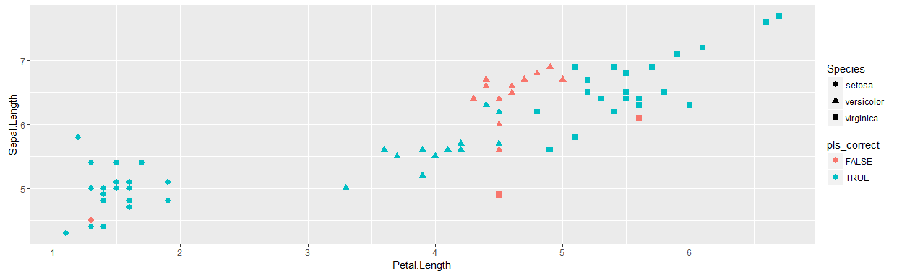

**There are so many misclassified points on the pls plot.**

####Naive Bayes Model 

```r
set.seed(117)
nb_fit <- train(Species~.,method="nb",data=training, tuneLength = 15, trControl = ctrl)
nb_pred <-predict(nb_fit, newdata = testing)
```

####Model Performance

```r
library(caret)
nb_correct <-nb_pred == testing$Species
confusionMatrix(nb_fit)###Misclasification on the training data
```

```
## Cross-Validated (10 fold, repeated 5 times) Confusion Matrix 
## 
## (entries are percentages of table totals)
##  
##             Reference
## Prediction   setosa versicolor virginica
##   setosa       33.4        0.0       0.0
##   versicolor    0.0       28.8       2.4
##   virginica     0.0        4.5      31.0
```

```r
table(nb_pred,testing$Species)###Misclasification on the testing data
```

```
##             
## nb_pred      setosa versicolor virginica
##   setosa         25          0         0
##   versicolor      0         23         1
##   virginica       0          2        24
```

```r
getTrainPerf(nb_fit)###Model's performance on the training data
```

```
##   TrainAccuracy TrainKappa method
## 1     0.9317063  0.8965865     nb
```

```r
postResample(nb_pred, testing$Species)###Model's performance on the testing data
```

```
## Accuracy    Kappa 
##     0.96     0.94
```

###Misclassified points illustrated in the nb plot

```r
library(ggplot2)
ggplot(testing) + geom_point(aes(Petal.Length, Petal.Width, colour = nb_correct, shape = Species),size = 2.5) + labs(x = "Petal.Length", y = "Petal.Width") 
```


```r
ggplot(testing) + geom_point(aes(Petal.Length, Sepal.Length, colour = nb_correct, shape = Species), size = 2.5) + labs(x = "Petal.Length", y = "Sepal.Length") 
```

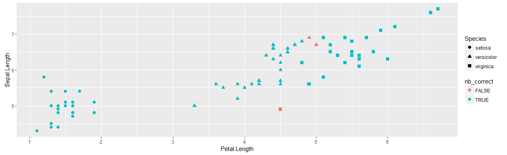

**These are the misclassified points on the nb plot.**

```r
subset(testing2, Row.Num == 107 | Row.Num == 78 | Row.Num == 53)
```

```
##    Sepal.Length Sepal.Width Petal.Length Petal.Width    Species Row.Num
## 27          6.9         3.1          4.9         1.5 versicolor      53
## 41          6.7         3.0          5.0         1.7 versicolor      78
## 56          4.9         2.5          4.5         1.7  virginica     107
```

####Neural Network Model 

```r
set.seed(117)
nnet_fit <- train(Species~.,method="nnet",data=training, tuneLength = 15, trControl = ctrl, verbose=FALSE)
nnet_pred <-predict(nnet_fit, newdata = testing)
```

####Model Performance

```r
library(caret)
nnet_correct <-nnet_pred == testing$Species
confusionMatrix(nnet_fit)###Misclasification on the training data
```

```
## Cross-Validated (10 fold, repeated 5 times) Confusion Matrix 
## 
## (entries are percentages of table totals)
##  
##             Reference
## Prediction   setosa versicolor virginica
##   setosa       33.4        0.0       0.0
##   versicolor    0.0       29.3       0.0
##   virginica     0.0        4.0      33.3
```

```r
table(nnet_pred,testing$Species)###Misclasification on the testing data
```

```
##             
## nnet_pred    setosa versicolor virginica
##   setosa         25          0         0
##   versicolor      0         22         0
##   virginica       0          3        25
```

```r
getTrainPerf(nnet_fit)###Model's performance on the training data
```

```
##   TrainAccuracy TrainKappa method
## 1      0.960119  0.9398728   nnet
```

```r
postResample(nnet_pred, testing$Species)###Model's performance on the testing data
```

```
## Accuracy    Kappa 
##     0.96     0.94
```

###Misclassified points illustrated in the nnet plot

```r
library(ggplot2)
ggplot(testing) + geom_point(aes(Petal.Length, Petal.Width, colour = nnet_correct, shape = Species),size = 2.5) + labs(x = "Petal.Length", y = "Petal.Width") 
```

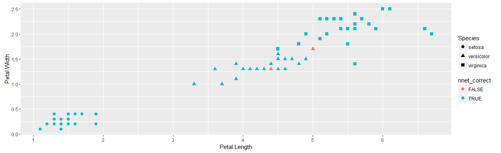


```r
ggplot(testing) + geom_point(aes(Petal.Length, Sepal.Length, colour = nnet_correct, shape = Species), size = 2.5) + labs(x = "Petal.Length", y = "Sepal.Length") 
```

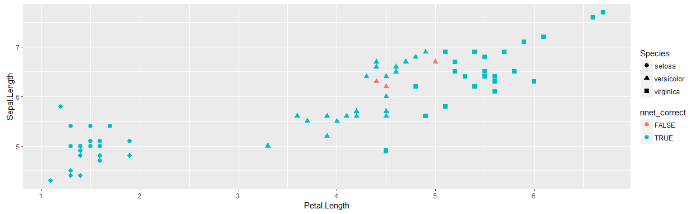

**These are the misclassified points on the nnet plot.**

```r
subset(testing2, Row.Num == 78 | Row.Num == 69 | Row.Num == 88)
```

```
##    Sepal.Length Sepal.Width Petal.Length Petal.Width    Species Row.Num
## 36          6.2         2.2          4.5         1.5 versicolor      69
## 41          6.7         3.0          5.0         1.7 versicolor      78
## 46          6.3         2.3          4.4         1.3 versicolor      88
```

####Bagged CART Model treebag

```r
set.seed(117)
treebag_fit <- train(Species~.,method="treebag",data=training, tuneLength = 15, trControl = ctrl, verbose=FALSE)
treebag_pred <-predict(treebag_fit, newdata = testing)
```

####Model Performance

```r
library(caret)
treebag_correct <-treebag_pred == testing$Species
confusionMatrix(treebag_fit)###Misclasification on the training data
```

```
## Cross-Validated (10 fold, repeated 5 times) Confusion Matrix 
## 
## (entries are percentages of table totals)
##  
##             Reference
## Prediction   setosa versicolor virginica
##   setosa       33.4        0.0       0.0
##   versicolor    0.0       29.3       3.5
##   virginica     0.0        4.0      29.8
```

```r
table(treebag_pred,testing$Species)###Misclasification on the testing data
```

```
##             
## treebag_pred setosa versicolor virginica
##   setosa         25          0         0
##   versicolor      0         23         2
##   virginica       0          2        23
```

```r
getTrainPerf(treebag_fit)###Model's performance on the training data
```

```
##   TrainAccuracy TrainKappa  method
## 1     0.9247222  0.8858101 treebag
```

```r
postResample(treebag_pred, testing$Species)###Model's performance on the testing data
```

```
##  Accuracy     Kappa 
## 0.9466667 0.9200000
```

###Misclassified points illustrated in the treebag plot

```r
library(ggplot2)
ggplot(testing) + geom_point(aes(Petal.Length, Petal.Width, colour = treebag_correct, shape = Species),size = 2.5) + labs(x = "Petal.Length", y = "Petal.Width") 
```

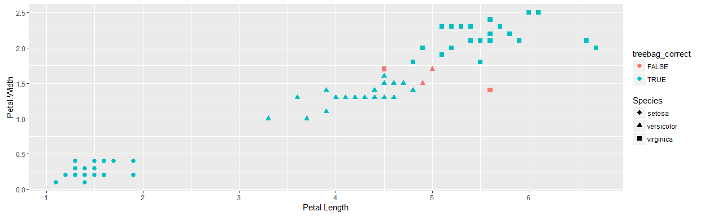


```r
ggplot(testing) + geom_point(aes(Petal.Length, Sepal.Length, colour = treebag_correct, shape = Species), size = 2.5) + labs(x = "Petal.Length", y = "Sepal.Length") 
```


**These are the misclassified points on the treebag plot.**

```r
subset(testing2, Row.Num == 107 | Row.Num == 78 | Row.Num == 135 | Row.Num == 53)
```

```
##    Sepal.Length Sepal.Width Petal.Length Petal.Width    Species Row.Num
## 27          6.9         3.1          4.9         1.5 versicolor      53
## 41          6.7         3.0          5.0         1.7 versicolor      78
## 56          4.9         2.5          4.5         1.7  virginica     107
## 67          6.1         2.6          5.6         1.4  virginica     135
```

####Penalized Multinomial Regression Model 

```r
set.seed(117)
multinom_fit <- train(Species~.,method="multinom",data=training, tuneLength = 15, trControl = ctrl, verbose=FALSE)
multinom_pred <-predict(multinom_fit, newdata = testing)
```

####Model Performance

```r
library(caret)
multinom_correct <-multinom_pred == testing$Species
confusionMatrix(multinom_fit)###Misclasification on the training data
```

```
## Cross-Validated (10 fold, repeated 5 times) Confusion Matrix 
## 
## (entries are percentages of table totals)
##  
##             Reference
## Prediction   setosa versicolor virginica
##   setosa       33.4        0.0       0.0
##   versicolor    0.0       29.3       0.2
##   virginica     0.0        4.0      33.1
```

```r
table(multinom_pred,testing$Species)###Misclasification on the testing data
```

```
##              
## multinom_pred setosa versicolor virginica
##    setosa         25          0         0
##    versicolor      0         24         0
##    virginica       0          1        25
```

```r
getTrainPerf(multinom_fit)###Model's performance on the training data
```

```
##   TrainAccuracy TrainKappa   method
## 1     0.9578968  0.9365395 multinom
```

```r
postResample(multinom_pred, testing$Species)###Model's performance on the testing data
```

```
##  Accuracy     Kappa 
## 0.9866667 0.9800000
```

###Misclassified points illustrated in the multinom plot

```r
library(ggplot2)
ggplot(testing) + geom_point(aes(Petal.Length, Petal.Width, colour = multinom_correct, shape = Species),size = 2.5) + labs(x = "Petal.Length", y = "Petal.Width") 
```

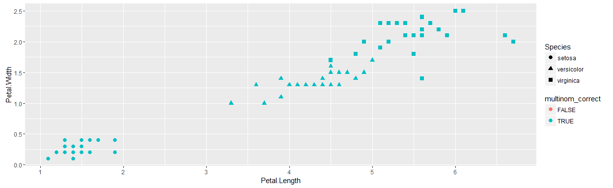


```r
ggplot(testing) + geom_point(aes(Petal.Length, Sepal.Length, colour = multinom_correct, shape = Species), size = 2.5) + labs(x = "Petal.Length", y = "Sepal.Length") 
```

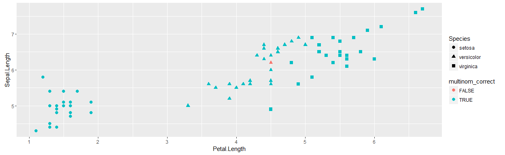

**These are the misclassified points on the multinom plot.**

```r
subset(testing2, Row.Num == 69)
```

```
##    Sepal.Length Sepal.Width Petal.Length Petal.Width    Species Row.Num
## 36          6.2         2.2          4.5         1.5 versicolor      69
```

###Finding the missing points

```r
table(testing$Sepal.Length)
```

```
## 
## 4.3 4.4 4.5 4.7 4.8 4.9   5 5.1 5.2 5.4 5.5 5.6 5.7 5.8   6 6.1 6.2 6.3 
##   1   2   1   1   4   3   6   4   1   4   2   6   2   3   2   1   3   3 
## 6.4 6.5 6.6 6.7 6.8 6.9 7.1 7.2 7.6 7.7 
##   6   4   2   4   2   4   1   1   1   1
```

```r
table(testing$Petal.Width)
```

```
## 
## 0.1 0.2 0.3 0.4   1 1.1 1.3 1.4 1.5 1.6 1.7 1.8 1.9   2 2.1 2.2 2.3 2.4 
##   3  13   4   5   2   1   9   5   7   1   2   3   2   3   5   2   5   1 
## 2.5 
##   2
```

```r
table(testing$Petal.Length)
```

```
## 
## 1.1 1.2 1.3 1.4 1.5 1.6 1.7 1.9 3.3 3.6 3.7 3.9   4 4.1 4.2 4.3 4.4 4.5 
##   1   1   4   7   5   4   1   2   1   1   1   2   1   1   2   1   3   7 
## 4.6 4.7 4.8 4.9   5 5.1 5.2 5.3 5.4 5.5 5.6 5.7 5.8 5.9   6 6.1 6.6 6.7 
##   2   1   2   2   1   3   2   1   2   3   4   1   1   1   1   1   1   1
```

```r
print(testing[order(testing$Petal.Length),])
```

```
##     Sepal.Length Sepal.Width Petal.Length Petal.Width    Species
## 14           4.3         3.0          1.1         0.1     setosa
## 15           5.8         4.0          1.2         0.2     setosa
## 17           5.4         3.9          1.3         0.4     setosa
## 39           4.4         3.0          1.3         0.2     setosa
## 41           5.0         3.5          1.3         0.3     setosa
## 42           4.5         2.3          1.3         0.3     setosa
## 2            4.9         3.0          1.4         0.2     setosa
## 5            5.0         3.6          1.4         0.2     setosa
## 9            4.4         2.9          1.4         0.2     setosa
## 13           4.8         3.0          1.4         0.1     setosa
## 38           4.9         3.6          1.4         0.1     setosa
## 46           4.8         3.0          1.4         0.3     setosa
## 50           5.0         3.3          1.4         0.2     setosa
## 8            5.0         3.4          1.5         0.2     setosa
## 11           5.4         3.7          1.5         0.2     setosa
## 20           5.1         3.8          1.5         0.3     setosa
## 32           5.4         3.4          1.5         0.4     setosa
## 40           5.1         3.4          1.5         0.2     setosa
## 27           5.0         3.4          1.6         0.4     setosa
## 30           4.7         3.2          1.6         0.2     setosa
## 31           4.8         3.1          1.6         0.2     setosa
## 47           5.1         3.8          1.6         0.2     setosa
## 6            5.4         3.9          1.7         0.4     setosa
## 25           4.8         3.4          1.9         0.2     setosa
## 45           5.1         3.8          1.9         0.4     setosa
## 94           5.0         2.3          3.3         1.0 versicolor
## 65           5.6         2.9          3.6         1.3 versicolor
## 82           5.5         2.4          3.7         1.0 versicolor
## 60           5.2         2.7          3.9         1.4 versicolor
## 70           5.6         2.5          3.9         1.1 versicolor
## 54           5.5         2.3          4.0         1.3 versicolor
## 89           5.6         3.0          4.1         1.3 versicolor
## 95           5.6         2.7          4.2         1.3 versicolor
## 97           5.7         2.9          4.2         1.3 versicolor
## 75           6.4         2.9          4.3         1.3 versicolor
## 66           6.7         3.1          4.4         1.4 versicolor
## 76           6.6         3.0          4.4         1.4 versicolor
## 88           6.3         2.3          4.4         1.3 versicolor
## 52           6.4         3.2          4.5         1.5 versicolor
## 56           5.7         2.8          4.5         1.3 versicolor
## 67           5.6         3.0          4.5         1.5 versicolor
## 69           6.2         2.2          4.5         1.5 versicolor
## 79           6.0         2.9          4.5         1.5 versicolor
## 86           6.0         3.4          4.5         1.6 versicolor
## 107          4.9         2.5          4.5         1.7  virginica
## 55           6.5         2.8          4.6         1.5 versicolor
## 59           6.6         2.9          4.6         1.3 versicolor
## 87           6.7         3.1          4.7         1.5 versicolor
## 77           6.8         2.8          4.8         1.4 versicolor
## 127          6.2         2.8          4.8         1.8  virginica
## 53           6.9         3.1          4.9         1.5 versicolor
## 122          5.6         2.8          4.9         2.0  virginica
## 78           6.7         3.0          5.0         1.7 versicolor
## 102          5.8         2.7          5.1         1.9  virginica
## 142          6.9         3.1          5.1         2.3  virginica
## 143          5.8         2.7          5.1         1.9  virginica
## 146          6.7         3.0          5.2         2.3  virginica
## 148          6.5         3.0          5.2         2.0  virginica
## 116          6.4         3.2          5.3         2.3  virginica
## 140          6.9         3.1          5.4         2.1  virginica
## 149          6.2         3.4          5.4         2.3  virginica
## 113          6.8         3.0          5.5         2.1  virginica
## 117          6.5         3.0          5.5         1.8  virginica
## 138          6.4         3.1          5.5         1.8  virginica
## 129          6.4         2.8          5.6         2.1  virginica
## 133          6.4         2.8          5.6         2.2  virginica
## 135          6.1         2.6          5.6         1.4  virginica
## 137          6.3         3.4          5.6         2.4  virginica
## 121          6.9         3.2          5.7         2.3  virginica
## 105          6.5         3.0          5.8         2.2  virginica
## 103          7.1         3.0          5.9         2.1  virginica
## 101          6.3         3.3          6.0         2.5  virginica
## 110          7.2         3.6          6.1         2.5  virginica
## 106          7.6         3.0          6.6         2.1  virginica
## 123          7.7         2.8          6.7         2.0  virginica
```

###Frequently Missed data points


```r
library(knitr)
Missed_points <- subset(testing2, Row.Num == 42 | Row.Num == 53 | Row.Num == 69 | Row.Num == 77 | Row.Num == 78 | Row.Num == 88 | Row.Num == 107 | Row.Num == 127 | Row.Num == 135)
Missed_points$Times.Missed <- c(1, 4, 3, 1, 7, 1, 6, 1, 3)
print(kable(Missed_points[order(Missed_points$Times.Missed),]))
```

```
## 
## 
##       Sepal.Length   Sepal.Width   Petal.Length   Petal.Width  Species      Row.Num    Times.Missed
## ---  -------------  ------------  -------------  ------------  -----------  --------  -------------
## 21             4.5           2.3            1.3           0.3  setosa       42                    1
## 40             6.8           2.8            4.8           1.4  versicolor   77                    1
## 46             6.3           2.3            4.4           1.3  versicolor   88                    1
## 64             6.2           2.8            4.8           1.8  virginica    127                   1
## 36             6.2           2.2            4.5           1.5  versicolor   69                    3
## 67             6.1           2.6            5.6           1.4  virginica    135                   3
## 27             6.9           3.1            4.9           1.5  versicolor   53                    4
## 56             4.9           2.5            4.5           1.7  virginica    107                   6
## 41             6.7           3.0            5.0           1.7  versicolor   78                    7
```

**I did not include the missing points in the svm and plr models in the tally above because they were too many. There was probably a mistake in the tuning parameter that i didn't take into consideration.**

###Conclusion

The penalized multinomial regression model and the linear discriminatory model performed the best with only one misclassified data point on the testing data set.  The most common data point that was misclassified  belongs to row 78 of the versicolor species.  Most of the point that were misclassified were in the area where the the versicolor and virginica species intermingled.  

It was quite a surprise when the penalized logistic regression model misclassified the whole virginica species and partail least square model misclassifed a data point in the setosa species.  Even more surprising is when the neural network model and the support vector machine model miisclassified a point which has a duplicate value only one of the duplicate was misclassified.  


```r
sessionInfo()
```

```
## R version 3.2.4 (2016-03-10)
## Platform: i386-w64-mingw32/i386 (32-bit)
## Running under: Windows 10 (build 10586)
## 
## locale:
## [1] LC_COLLATE=English_United States.1252 
## [2] LC_CTYPE=English_United States.1252   
## [3] LC_MONETARY=English_United States.1252
## [4] LC_NUMERIC=C                          
## [5] LC_TIME=English_United States.1252    
## 
## attached base packages:
## [1] stats     graphics  grDevices utils     datasets  methods   base     
## 
## other attached packages:
## [1] knitr_1.12.3    kernlab_0.9-23  caret_6.0-64    lattice_0.20-33
## [5] ggplot2_2.1.0  
## 
## loaded via a namespace (and not attached):
##  [1] minqa_1.2.4        class_7.3-14       formatR_1.3       
##  [4] stringr_1.0.0      parallel_3.2.4     pbkrtest_0.4-6    
##  [7] SparseM_1.7        labeling_0.3       Rcpp_0.12.4       
## [10] lava_1.4.1         car_2.1-1          plyr_1.8.3        
## [13] highr_0.5.1        tools_3.2.4        MASS_7.3-45       
## [16] nlme_3.1-126       rmarkdown_0.9.5    scales_0.3.0      
## [19] MatrixModels_0.4-1 nnet_7.3-12        lme4_1.1-11       
## [22] digest_0.6.9       gtable_0.2.0       evaluate_0.8.3    
## [25] Matrix_1.2-4       foreach_1.4.3      stringi_1.0-1     
## [28] reshape2_1.4.1     htmltools_0.3      rpart_4.1-10      
## [31] munsell_0.4.3      grid_3.2.4         colorspace_1.2-6  
## [34] quantreg_5.21      nloptr_1.0.4       magrittr_1.5      
## [37] splines_3.2.4      yaml_2.1.13        stats4_3.2.4      
## [40] ipred_0.9-5        survival_2.38-3    prodlim_1.5.7     
## [43] mgcv_1.8-12        e1071_1.6-7        iterators_1.0.8   
## [46] codetools_0.2-14
```
